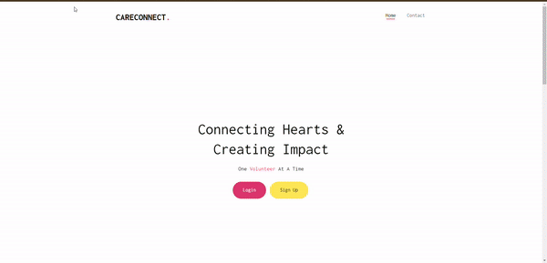

# CareConnect: Connecting Volunteers with Nursing Homes

Welcome to CareConnect, a volunteer matching site designed to combat isolation and depression in nursing homes. CareConnect aims to fulfill the desire for human connection and embraces the power of storytelling that seniors cherish.

Link to Live Site: https://careconnect.up.railway.app/

## How It's Made

CareConnect is a full-stack application developed using the following technologies:

**Frontend: HTML, EJS, CSS, JavaScript
**Backend: Node.js
**Database: MongoDB

The application utilizes CRUD API functionality to facilitate user registration, volunteer matching, and overall management of volunteer activities in nursing homes. Here's a brief overview of the development process:

**Database Design: I structured the MongoDB database to efficiently store user information, nursing home details, and volunteer activities.

**Backend Development: Using Node.js, I created robust APIs to handle user registration, authentication, and volunteer matching.

**Frontend Implementation: The frontend, developed with HTML, EJS, and CSS, provides a user-friendly interface for volunteers to sign up and browse available opportunities.

**Interactive Features: CareConnect includes dynamic features using JavaScript to enhance the user experience and make the volunteer matching process seamless.

## Lessons Learned

**Building CareConnect has been a rewarding experience, and it has taught me valuable lessons, including:

**User-Centric Design: Prioritizing user experience is crucial, especially in applications aimed at vulnerable populations.

**Continuous Learning: Embracing the iterative nature of development and continuously seeking opportunities to learn and grow.

**Passion for Impact: The realization that technology can be a powerful force for positive change, addressing social issues and fostering meaningful connections.

## Installation

1. Clone repo
2. run `npm install`

## Usage

1. run `node server.js`
2. Navigate to `localhost:5664`
